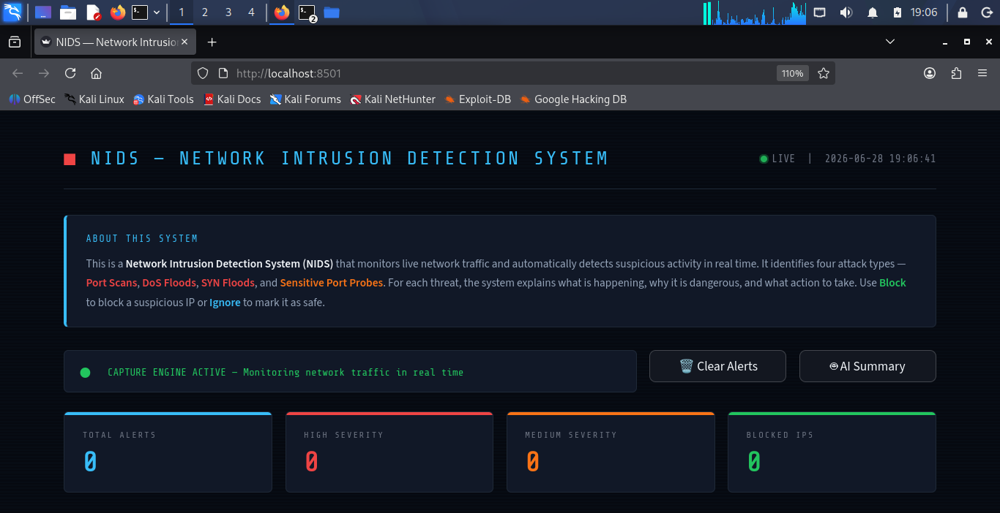

<div align="center">

# 🛡️ AI-Assisted Network Intrusion Detection System (NIDS)

A real-time AI-assisted Network Intrusion Detection System built with Python, Scapy, Streamlit, and Claude AI for monitoring live network traffic, detecting cyber threats, and generating intelligent security summaries.


</div>

---

# 📖 Overview

This project captures live network packets, detects malicious activities using behavioral analysis, and displays alerts through an interactive Streamlit dashboard.

To improve incident response, the system integrates the **Claude API** to generate AI-powered threat summaries, helping analysts quickly understand detected attacks and recommended actions.

---

# ✨ Features

- 📡 Live packet capture using Scapy
- 🛡️ Real-time intrusion detection
- 🤖 AI-generated threat summaries using Claude API
- 📊 Interactive Streamlit dashboard
- 🚨 Threat severity classification
- 📈 Live threat statistics
- 🚫 Block suspicious IP addresses
- ✅ Ignore trusted IP addresses
- ⚡ Controlled attack simulator
- 📋 Session review and monitoring

---

# 🔍 Supported Attack Detection

| Attack | Description |
|---------|-------------|
| Port Scan | Detects scanning of multiple ports by a single host |
| DoS Flood | Detects excessive traffic from one source |
| SYN Flood | Detects incomplete TCP handshake attacks |
| Sensitive Port Probe | Detects access attempts to SSH, SMB, RDP and other sensitive ports |

---

# 🛠️ Technologies Used

- Python
- Streamlit
- Scapy
- Pandas
- JSON
- Claude API
- Kali Linux

---

# 📸 Application Screenshots

## Dashboard



---

## Live Traffic Monitoring


---

## AI Summary


---

## Live Monitoring & Review Options


---

## Live Threat Feed


---

# ▶️ Running the Project

Start the Streamlit dashboard:

```bash
streamlit run src/app.py
```

Open:

```
http://localhost:8501
```

Run the packet capture engine:

```bash
sudo python3 src/capture.py
```

Launch the attack simulator:

```bash
python3 src/attack_simulator.py
```

---

# 🤖 AI Integration

The Claude API automatically generates:

- AI-powered threat summaries
- Attack explanations
- Risk assessment
- Recommended mitigation actions

This allows security analysts to understand incidents quickly without manually reviewing every alert.

---

# 📂 Project Structure

```text
AI-Assisted-Network-Intrusion-Detection-System
│
├── src
│   ├── app.py
│   ├── capture.py
│   ├── attack_simulator.py
│   └── alerts.json
│
├── screenshots
│   ├── AI Summary.png
│   ├── Capturing terrafic.png
│   ├── Dashboard.png.png
│   ├── LIve monitoring and Review options.png
│   └── Live threat feed.png
│
└── README.md
```

---

# 🔄 Workflow

1. Capture network packets.
2. Analyze traffic patterns.
3. Detect suspicious activities.
4. Classify the attack type.
5. Display alerts on the dashboard.
6. Generate an AI-assisted threat summary.
7. Allow the operator to Block or Ignore suspicious IP addresses.

---

# ⚠️ Disclaimer

This project was developed strictly for **educational and research purposes**.

All attack demonstrations were performed in a **controlled laboratory environment** using a custom attack simulator. No attacks were conducted against external or unauthorized systems.

---

# 🚀 Future Improvements

- Machine Learning-based anomaly detection
- Firewall integration
- Email notifications
- Threat intelligence feeds
- Multi-device monitoring
- Docker deployment
- Database integration
- User authentication

---

# 👩‍💻 Author

**Muqadas Ishfaq**

Graduate | Cybersecurity & Networking Enthusiast

Currently preparing for the **ISC2 Certified in Cybersecurity (CC)** certification while building AI-assisted cybersecurity projects.

GitHub: https://github.com/muqadasishfaq
